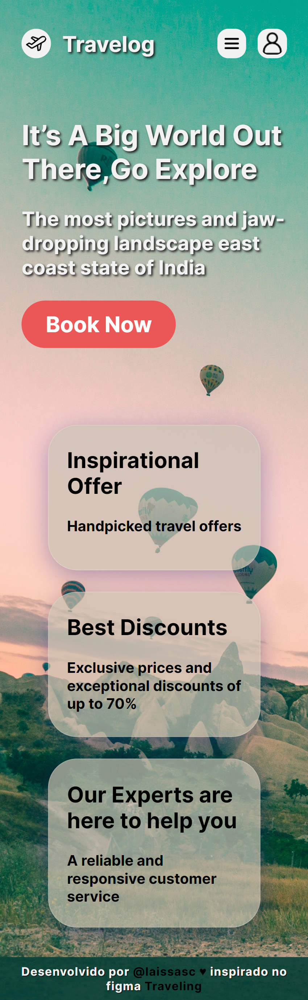

# **Travelog** 👩🏾‍💻 

&nbsp;
&nbsp;
&nbsp;
&nbsp;
&nbsp;
 

## Projeto desenvolvido com base no layout **_[Traveling](<https://www.figma.com/file/iMhijXft9pk75a07scYQcp/Traveling-(Community)?node-id=0%3A1>)_** do Figma Community.

 

> ### Objetivos do projeto:

 

- Desenvolver o layout do _Figma_ utilizando as stacks: _HTML_, _CSS_ e _JavaScript_;
- Desenvolver a responsividade do projeto, incluindo um **Menu Mobile**;
- Desenvolver o projeto utilizando o fluxo de versionamento com o **'git-flow'**.

  

### Veja a seguir como ficaram as versões: _Desktop_, _Tablet_ e _Mobile_.

 

.
.
.
